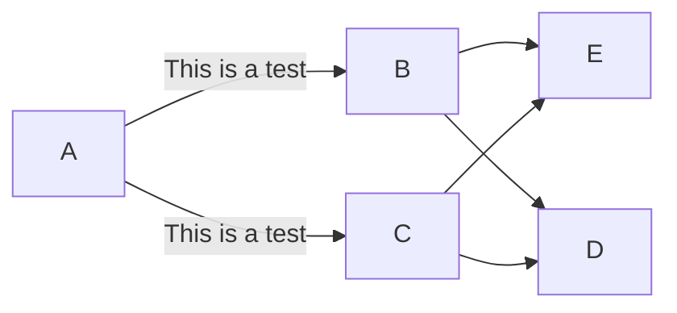
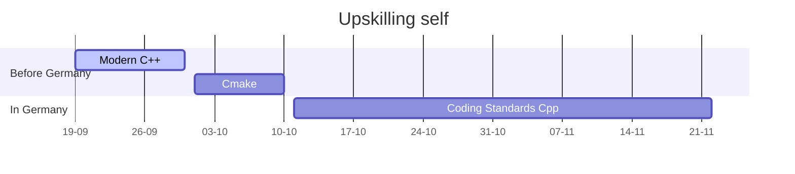
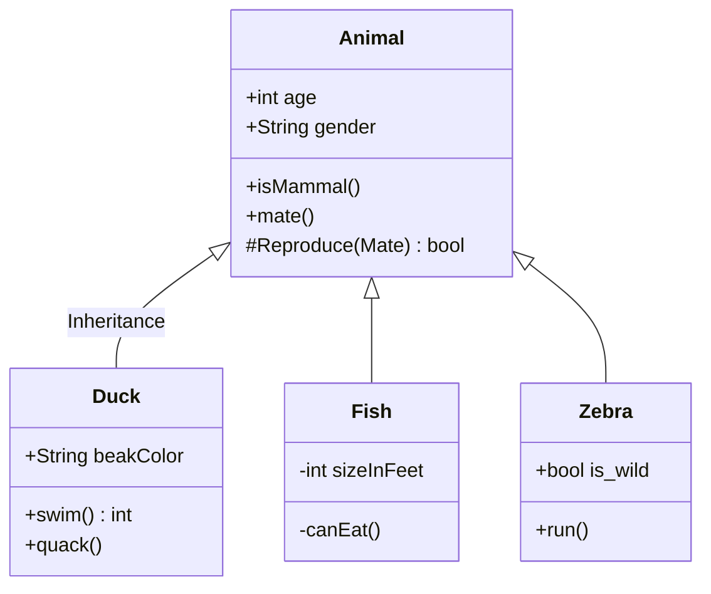
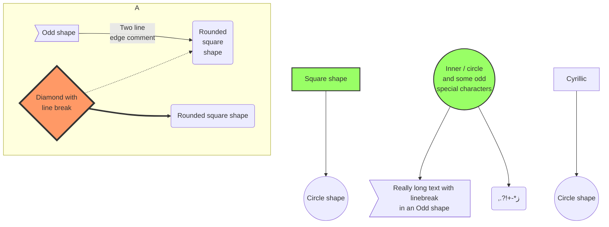

```mermaid
graph LR;
A --This is a test--> B & C --> E;
B & C --> D;
```

```mermaid
gantt
title Upskilling self
dateFormat  YYYY-MM-DD
axisFormat  %d-%m
section Before Germany 
Modern C++       :active , a1, 2021-09-19 , 2021-09-30
Cmake            :       a2, 2021-10-01, 2021-10-10
section In Germany
Coding Standards Cpp     :desc2, 2021-10-11 , 6w
```

```mermaid
classDiagram
      Animal <|-- Duck: Inheritance
      Animal <|-- Fish
      Animal <|-- Zebra
      Animal : +int age
      Animal : +String gender
      Animal: +isMammal()
      Animal: +mate()
      Animal: #Reproduce( Mate) bool
      class Duck{
          +String beakColor
          +swim() int
          +quack()
      }
      class Fish{
          -int sizeInFeet
          -canEat()
      }
      class Zebra{
          +bool is_wild
          +run()
      }
```

```mermaid
graph TB
    sq[Square shape] --> ci((Circle shape))

    subgraph A
        od>Odd shape]-- Two line<br/>edge comment --> ro
        di{Diamond with <br/> line break} -.-> ro(Rounded<br>square<br>shape)
        di==>ro2(Rounded square shape)
    end

    %% Notice that no text in shape are added here instead that is appended further down
    e --> od3>Really long text with linebreak<br>in an Odd shape]

    %% Comments after double percent signs
    e((Inner / circle<br>and some odd <br>special characters)) --> f(,.?!+-*ز)

    cyr[Cyrillic]-->cyr2((Circle shape));

     classDef green fill:#9f6,stroke:#333,stroke-width:2px;
     classDef orange fill:#f96,stroke:#333,stroke-width:4px;
     class sq,e green
     class di orange
```
